# 🦕 Dino Encyclopedia

A Django MVC web application for exploring dinosaurs and geological periods. Built with Python, Django, and Bootstrap.


---

## 📖 Project Overview

**Dino Encyclopedia** is an educational web application that allows users to explore dinosaurs from different geological periods (Triassic, Jurassic, Cretaceous). The project demonstrates a **classical MVC (Model-View-Controller)** architecture implemented using Django.

### Key Features

- 🔐 **User Authentication** - Register, login, and guest access
- 🗺️ **Geological Map** - Explore the Mesozoic Era periods
- 🖼️ **Dinosaur Gallery** - Browse and filter dinosaurs by period and diet
- 📚 **Educational Library** - Learn about dinosaurs and their habitats
- 👤 **User Profiles** - Track collection progress and game scores
- 🎮 **Mini-Games** - Puzzleaurus game with score tracking
- 💰 **Token System** - Earn tokens by discovering dinosaurs and playing games

---

## 🏗️ Architecture: MVC Pattern

This project follows the **MVC (Model-View-Controller)** pattern. Django calls it MVT (Model-View-Template), but the mapping is:

| Classical MVC | Django Implementation | Location |
|---------------|----------------------|----------|
| **Model** | Django Models | `encyclopedia/models.py` |
| **Controller** | Django Views + Services | `encyclopedia/views.py` + `services.py` |
| **View** | Django Templates | `encyclopedia/templates/` |

For detailed architecture documentation, see [docs/ARCHITECTURE.md](docs/ARCHITECTURE.md).

### Architecture Diagrams

#### View Layer (Pages/Screens)


#### Controller Layer (Business Logic)


#### State Transitions (Navigation Flow)


#### Conceptual Model (Domain Interactions)


#### Login Sequence (Authentication Flow)


---

## 🚀 Getting Started

### Prerequisites

- Python 3.11 or higher
- pip (Python package manager)
- Virtual environment (recommended)

### Installation

1. **Clone the repository**
   ```bash
   git clone https://github.com/lichdencor/Dino-Encyclopedia.git
   cd Dino-Encyclopedia-matt
   ```

2. **Create and activate virtual environment**
   ```bash
   # Windows
   python -m venv venv
   .\venv\Scripts\activate

   # Linux/Mac
   python3 -m venv venv
   source venv/bin/activate
   ```

3. **Install dependencies**
   ```bash
   pip install -r requirements.txt
   ```

4. **Run database migrations**
   ```bash
   python manage.py migrate
   ```

5. **Seed the database with initial data**
   ```bash
   python manage.py seed
   ```

6. **Run the development server**
   ```bash
   python manage.py runserver
   ```

7. **Open your browser**
   Navigate to: `http://localhost:8000`

---

## 👥 Test Credentials

The seed command creates a test user account:

- **Username:** `test`
- **Password:** `test123`

You can also create a new account or use guest login.

---

## 📁 Project Structure

```
dino_encyclopedia/          # Django project settings
│
encyclopedia/               # Main application (MVC components)
├── models.py              # MODEL: Domain entities (Dinosaur, Period, User)
├── views.py               # CONTROLLER: Request handlers
├── services.py            # Business logic layer
├── urls.py                # URL routing
├── admin.py               # Django admin panel configuration
├── templates/             # VIEW: HTML templates
│   ├── auth/             # Login, Register pages
│   ├── gallery/          # Dinosaur list and details
│   ├── home.html
│   ├── map.html
│   ├── library.html
│   ├── profile.html
│   └── puzzleaurus.html
└── management/commands/   # Custom management commands
    └── seed.py           # Database seeding

static/                    # CSS, JavaScript, Images
├── css/style.css
└── images/

docs/                      # Documentation
├── ARCHITECTURE.md       # Detailed MVC architecture explanation
└── diagrams/             # UML and architecture diagrams
    ├── source/           # Mermaid source files (.mmd)
    └── rendered/         # Exported diagrams (.svg)

manage.py                  # Django management entry point
requirements.txt           # Python dependencies
```

---

## 🎯 MVC Responsibilities

### Model Layer (`models.py`)
- **Period**: Geological time periods
- **Dinosaur**: Dinosaur species with attributes
- **UserProfile**: User stats and tokens
- **AlbumItem**: Collection tracking
- **GameScore**: Game performance records

### Controller Layer (`views.py` + `services.py`)
- **Authentication**: Login, register, logout
- **Navigation**: Home, map, gallery, library, profile
- **Games**: Puzzleaurus controller
- **Services**: Business logic (filters, progress tracking, token management)

### View Layer (`templates/`)
- **Templates**: HTML with Django template language
- **Styling**: Bootstrap 5 + custom CSS
- **No Business Logic**: Templates only render data

---

## 🗃️ Database Models

### Core Models

**Period**
- Geological time periods (Triassic, Jurassic, Cretaceous)
- Timeframes in millions of years ago
- Descriptions and metadata

**Dinosaur**
- Name and scientific name
- Physical characteristics (length, weight)
- Diet type (herbivore, carnivore, omnivore)
- Period relationship
- Images and fun facts

**UserProfile**
- Token balance
- Collection progress
- Avatar (optional)

**AlbumItem**
- User's dinosaur collection
- Tracks discovered species

**GameScore**
- Mini-game scores
- Timestamp tracking

---

## 🎮 Features

### Authentication
- User registration with validation
- Login with username/password
- Guest access option
- Session management

### Geological Map
- Explore three geological periods
- View dinosaur counts per period
- Period descriptions and timelines

### Dinosaur Gallery
- Browse all dinosaurs
- Filter by period (Triassic, Jurassic, Cretaceous)
- Filter by diet (Herbivore, Carnivore, Omnivore)
- Search by name
- Detailed dinosaur pages with stats

### Library
- Educational content about periods
- Fun facts about dinosaurs
- Learning resources

### User Profile
- View collection progress
- Track tokens earned
- See game scores
- Update profile information

### Mini-Game: Puzzleaurus
- Interactive puzzle game
- Score tracking
- Token rewards

---

## 🛠️ Technology Stack

| Component | Technology |
|-----------|-----------|
| **Language** | Python 3.12+ |
| **Framework** | Django 5.0 |
| **Database** | SQLite |
| **Frontend** | Django Templates |
| **CSS Framework** | Bootstrap 5.3 |
| **Icons** | Bootstrap Icons |
| **Image Handling** | Pillow |

---

## 📊 Available Commands

```bash
# Run development server
python manage.py runserver

# Create database migrations
python manage.py makemigrations

# Apply migrations
python manage.py migrate

# Seed database with initial data
python manage.py seed

# Create superuser for admin panel
python manage.py createsuperuser

# Access admin panel
# Navigate to http://localhost:8000/admin
```

---

## 📚 Documentation

- **[Architecture Guide](docs/ARCHITECTURE.md)** - Detailed MVC architecture explanation
- **[Diagrams](docs/diagrams/)** - UML and system architecture diagrams

---

## 🤝 Contributing

This is an educational project for university coursework. If you'd like to contribute:

1. Fork the repository
2. Create a feature branch
3. Commit your changes
4. Push to the branch
5. Open a Pull Request

---

## 📝 License

This project is created for educational purposes.

---

## 👨‍💻 Author

**Dino Encyclopedia Project**
- University Project
- MVC Architecture Demonstration
- Django Framework Implementation

---

## 🙏 Acknowledgments

- Bootstrap for UI components
- Django documentation and community
- Dinosaur data from public paleontology resources

---

## 📸 Screenshots

### Home Page
Beautiful landing page with navigation cards and progress tracking.

### Geological Map
Interactive map showing the three periods of the Mesozoic Era.

### Dinosaur Gallery
Grid view of dinosaurs with filtering and search capabilities.

### Dinosaur Details
Comprehensive information about each dinosaur species.

---

## 🔮 Future Enhancements

- Interactive 3D dinosaur models
- More mini-games (Memodyn memory game)
- Achievement system
- Social features (share collections)
- REST API for mobile apps
- Multilingual support

---

**Enjoy exploring the prehistoric world! 🦖🦕**
